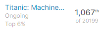

# Titanic: Machine Learning from Disaster

In this repository, you will find the road map that I followed to build a machine learning model for a Kaggle competition. The model's predictions have placed me in **top 6%** on the leaderboard (on 23th of Aug 20) with **80.143% score**.  

You can find further information about the competition [here](https://www.kaggle.com/c/titanic)  

Workflow:  
- Exploratory Data Analysis.  
  - Surviving rate
  - Pclass
  - Name
  - Sex
  - Age
  - SibSp, Parch
  - Ticket
  - Fare
  - Cabin
  - Embarked
- Feature Engineering   
  - Imputation on Embarked and Age columns
  - Title extraction
  - Ticket first letters
  - Cabin first letters
  - Encoding sex column
  - Family size
  - One Hot Encoding for all categorical variables
- Machine Learning
  - Split data into train and test sets
  - Initialize a Random Forest Classifier
  - Hyperparameter Tuning with Grid Search
  - Prediction
